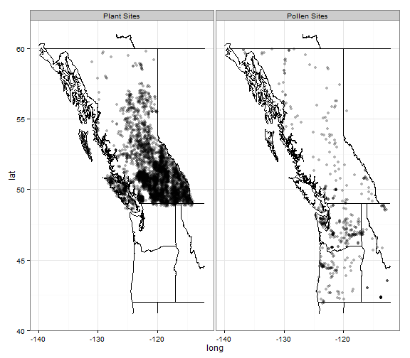
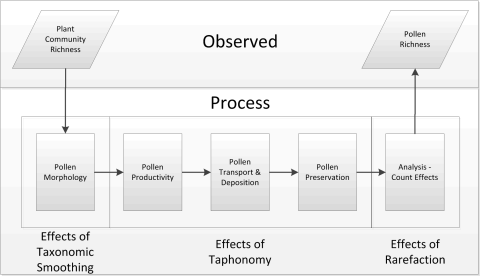
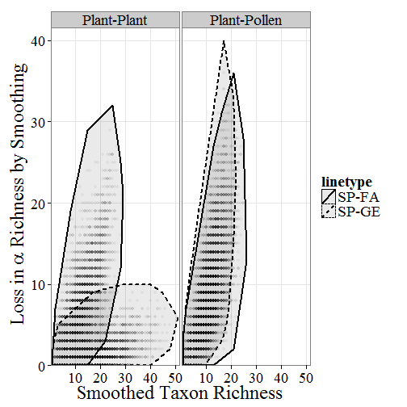
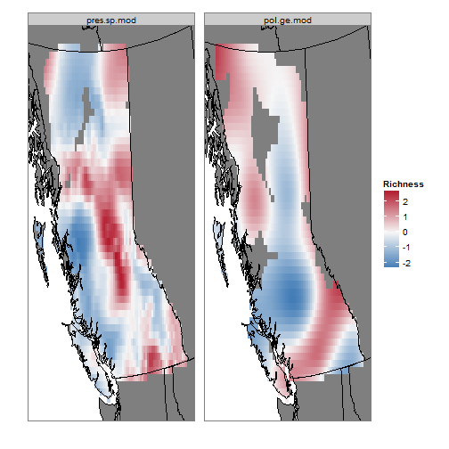
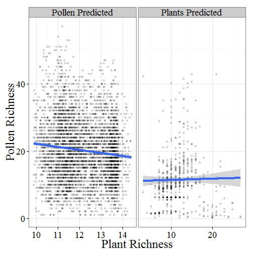

**This is the R Markdown version of the paper Goring et al. Pollen assemblage richness does not reflect regional plant species richness: a cautionary tale for palaeoecologists.**

**This document comes with the compiled HTML file (of the same name), but this file includes all the original R code and can be compiled using RStudio, with the knitr package.  Please note that although the results here will be numerically similar to those presented in the original paper, they will not be exactly the same.  This is for several reasons:**
**1.  Rounding and random number generation might induce small changes.  It is possible to include a random.seed in this code, but:**
**2.  The primary BC Plants dataset loaded in this file is only a part of the larger dataset.  Due to data-use agreements we have used a random subset of the larger dataset (30%), and we have jittered the plot locations by up to 0.2 degrees latitude (we have kept elevations unchanged).**

**All code in this document is by Simon Goring.**

Pollen assemblage richness does not reflect regional plant species richness: a cautionary tale for palaeoecologists
=============
Simon Goring*  
Department of Geography, University of Wisconsin – Madison, 550 N Park St, Madison WI USA, 53706; goring@wisc.edu, ph. 608-262-6523, fax, 608-265-3991

Terri Lacourse  
Department of Biology, University of Victoria, PO Box 3020, Station CSC, Victoria, BC V8W 3N5, Canada

Marlow G. Pellatt  
Parks Canada, Natural Resource Conservation, 300 - 300 West Georgia Street, Vancouver, British Columbia, Canada V6B 6B4

Rolf W. Mathewes  
Department of Biological Sciences, Simon Fraser University, 8888 University Dr, Burnaby, BC, Canada V5A 1S6


Summary
-------------------------
1.  Paleoecological records of species richness spanning time intervals over which climate variables have shifted relative to one another can help reduce issues of colinearity that might affect our understanding of patterns of species richness.

2.	Fossil pollen assemblages have the potential to serve as a proxy for past plant richness because they record the presence of plant taxa.  However, pollen assemblages are typically limited by low taxonomic resolution and taphonomic processes (pollen production, transport, deposition and preservation), which may degrade the degree to which pollen accurately represents vegetation communities.

3. We combined pollen assemblages from modern lake sediments (n=546; n = 167 in British Columbia, Canada) in the Pacific Northwest, with a detailed database (n = 16071) of plant presence across the province and a published record of gamma richness to test the accuracy of pollen assemblages as a proxy for regional patterns of plant richness.

4.  A generalized linear model (GLM) using plant richness resolved at multiple taxonomic levels suggests taxonomic differences between plant and pollen taxa may reduce the ability of pollen richness to predict plant richness at the site level, but that this relationship is still recoverable, albeit with broad confidence intervals.

5.  Spatially explicit analysis using a generalized additive model shows that predicted plant richness has no relationship with raw pollen assemblage richness at all taxonomic levels.

6.	The taxonomic composition of the region (i.e. the ratio of wind pollinated to insect pollinated species) and/or the morphological specificity of the dominant pollen types in the region may play a role in limiting the reconstruction of plant richness from pollen richness. Nonetheless, we believe this study is the first to empirically test the relationship between plant and pollen richness, and fails to find a significant relationship.

**Synthesis**: Palynological richness in itself cannot be considered a universally reliable proxy for inferring plant richness, however, broad spatial and temporal patterns of change in richness have been reported in the literature.  Our findings suggest that more work is needed to understand previously reported patterns of pollen assemblage richness through time and in space.  We suggest the use of functional diversity or phylogenetically-based analysis may help link pollen richness to plant community richness.

**Key-words**: diversity, generalized additive models,  palaeoecology and land-use history, palynology, plant ecology, pollen, rarefaction 

Introduction
-------------------------

The preservation of biodiversity meets several objectives:  it preserves the intrinsic value of species (Ghilarov, 2000), maintains population and community stability (Isbell et al. 2009) and serves to provide and maintain certain ecosystem services (Balvanera et al. 2006).  Reich et al. (2012) show the explicit value of biodiversity in maintaining regional productivity.  However, the challenge to researchers is that the underlying causes of biodiversity remain complex and the long term stability of biodiversity remains poorly understood (Turner 2004; Jablonski et al. 2006; Archibald et al. 2010).  This may be partly as a result of the fact that it is difficult to describe patterns of biodiversity in a paleoecological context (Rull 2012), although a number of studies have examined diversity or richness measures through time, and interest in understanding biodiversity using paleobiological tools is evident in the literature (e.g. Colombaroli et al. 2012).

Paleoecological records based on fossil pollen are confounded by differential pollen production across species and uneven preservation of specimens.  Certain taxa produce pollen that rarely enters the sedimentary record, whether through differential pollen production, dispersal or preservation (Birks and Birks 1980).  Taxa that are pollinated by insect or animal vectors (entomophilous or zoophilous, respectively) and species with limited dispersal ability are rarely recorded in fossil pollen records (Faegri and Iverson 1989; Jackson 1994).  Other taxa such as Poaceae, representing 11,462 species worldwide (The Plant List 2010), produce pollen that cannot be differentiated at the species or genus level, with some exceptions (e.g. Zea and Cereale in Poaceae).  Nonetheless, palynological richness is often used as an indicator of past species richness, either explicitly or implicitly (Birks and Line 1992; Jaramillo et al. 2006; Berglund et al. 2008; Birks and Birks, 2008; Brown et al. 2008; van der Knaap 2009; Morales-Molino et al., 2011; Colombaroli et al., 2012), despite the fact that the relationship between plant richness and pollen richness has not been well studied.  While pollen richness at a site may vary over time, temporal changes in richness may not be directly correlated with regional plant species richness.  A study of nine sites in Estonia demonstrated that palynological richness may be largely controlled by variability in local pollen productivity (Meltsov et al. 2011).  At coarse spatial scales, where multiple vegetation zones may be encountered, differences in catchment area may play a much larger role in determining richness (Seppä 1998).  

Pollen richness is probably controlled only in part by the dominant vegetation in a region.  At any one site pollen richness is more likely to reflect plant richness when the taxonomic specificity of the pollen recorded at a site is high and when there is a strong relationship between entomophilous and anemophilous (wind-pollinated) taxa.  However, the relationship between the numbers of taxa for each pollination syndrome and the pollen specificity of the pollen taxa represented at a site is likely to vary spatially and temporally (Regal 1982).  If relative numbers of entomophilous and anemophilous plant taxa vary spatially and these taxa have variable rates of deposition and preservation within the sedimentary environments from which fossil pollen is extracted, then we expect that the fundamental relationship between plant and pollen richness should not be universal, and is likely to be weaker than expected based on the existing literature.

Odgaard (2001) outlines two competing, but overlapping hypotheses on the mechanisms controlling pollen richness in sediments, those being (i) pollen richness is proportional to plant species richness and (ii) pollen richness is a function of pollen population evenness.  These hypotheses relate directly to estimates of pollen richness using rarefaction analysis (Hurlbert 1971), thus implicitly assuming that pollen reflects regional plant species richness, except inasmuch as analysis might affect this relationship.  Weng et al. (2006) and Peros and Gajewski (2008) present mathematical methods for testing pollen richness as a function of pollen counts, sediment accumulation rates, pollen concentration and palynological evenness but these are based on a theoretical framework that assumes pollen richness is related to vegetation richness in a fundamentally knowable way.  This may then be a case of ‘unknown knowns’ (Jackson 2012) i.e. a literature exists relating pollen diversity to plant diversity, but the roots of this assumption are unclear.

Given the possible problems inherent in reconstructing plant species richness from pollen assemblages and the need for testing this relationship, we present a direct test of the relationship between plant and pollen richness using large plant and pollen data sets from British Columbia, Canada.  We build spatial and point-based models relating pollen and plant taxonomic richness at multiple taxonomic levels to determine whether a relationship between pollen and plant richness can be detected, given the taxonomic and taphonomic constraints on pollen production and preservation and discuss the regional, global and disciplinary implications of our findings.

Materials and Methods
-------------------------

Pollen data was obtained from the British Columbia Modern Pollen Database (BCMPD, Goring et al., 2009, 2010).  This data set includes 546 lacustrine pollen sample sites from British Columbia, Canada, and Washington, Oregon, Idaho and Montana in the United States of America, of which 167 points are located within Canada. Plant data was obtained from the BEC Plants Database (Biogeoclimatic Ecosystem Classification Program. 2013; nsites = 48,706).  The BEC Plants dataset represents a systematic survey of plant communities in the province of British Columbia using a standard 400m2 plot design, except in alpine, grassland or wetland habitats. The sites cover a broad diversity of ecosystem types, soil classes, disturbance classes and other features. We removed all sites with low site-quality flags in the data set (n = 33,067) leaving a total of n = 14,529 sites.   The pollen and plant datasets have different spatial distributions (Fig. 1), explained largely by differential investigator effort and purpose.  Limitations of the distribution of pollen data are discussed further in Goring et al. (2009).

 

**Fig. 1**. *Point distribution for the plant (a) and pollen (b) data sets across British Columbia, Canada, and into adjacent Washington, Idaho and Montana in the United States of America (for pollen).*
Taxonomy for each dataset was standardized to be internally consistent to the species level, excluding hybrid species in the BC Plant dataset, to the pollen taxonomy of Whitmore et al. (2005). Plant taxonomy for the BC Plants data (family, genus and species) was verified using the accepted taxonomy in the ITIS database (http://www.itis.gov/) using the R package ritis (ROpenSci project: http://ropensci.org).  After taxonomic standardization the pollen dataset included 67 pollen taxa and the plant dataset included 1729 species from 490 genera and 97 families.

We assessed species richness for both plant and pollen sites across British Columbia, and the Pacific Northwest for pollen samples, as the sum of species or taxa present in a sample.  While measures of evenness are important for understanding ecological processes, it is important to note that individual pollen grains are not equivalent to individual plants and that pollen production by species varies enormously.  Additionally, the plant database is structured in such a way that evenness is difficult to assess at any one plot since percent coverage of taxa is divided into multiple vertical strata.  Since the spatial distribution of plant and pollen sample sites is uneven across the region, and since pollen richness is a representation of a regional taxon pool and plant richness in this dataset is an explicit measure of plot level diversity, we do not explicitly compare the two richness measures.  A regional vascular plant richness dataset does exist for British Columbia (Warman and Scudder 2007), however this data set uses both plot level data and herbaria samples, aggregated to 50 km grid cells, without correcting for sampling effort, meaning that those cells with higher sampling effort are likely to show higher richness as a result of sampling effort, rather than underlying patterns of richness.  Further, herbaria are likely to over-represent rare species and may not be suitable for estimates of species diversity at finer scales (ter Steege et al. 2011).


To assess whether or not pollen accurately reflects plant richness, we divided our analysis into units along the path from plant community to pollen assemblages (Fig. 2).  Although the stages of our diagram should result in a cumulative loss of fidelity between plant community richness and pollen richness, or a progressive increase in the unexplained variance in our models, we partitioned our analysis in such a way that analysis at each step attempts to explicitly test only the target process or processes.  All analyses were carried out in R (R Development Core Team, 2011), and the supplement contains the raw code (as an R Markdown file) necessary to replicate this analysis.

  

**Figure 2**.  *Flow chart illustrating the process by which plant communities are transformed to pollen assemblages in lake sediments.  Plant species have pollen morphologies that are phylogenetically constrained, each taxon produces pollen in various amounts, dependent on the species traits, this pollen is transported from the plant and deposited in a depositional basin where it is preserved.  The analyst processes and counts a certain number of grains, and thus constructs the pollen assemblage.*

### The Effects of Taxonomic Smoothing
The first step in the process diagram (Fig. 2) involves testing whether pollen production, the transition from plant taxa to pollen taxa (as opposed to productivity), affects the fidelity of pollen richness to plant richness.  Taxonomy in the plant dataset is not equivalent to pollen taxonomy.  While individuals in plant community plots are generally identified to species, pollen taxa are often only identifiable to genus, and sometimes to family.  Pollen morphology is largely constrained phylogenetically, such that within certain groups (such as Poaceae), it is generally considered too difficult to differentiate between taxa.  Other pollen taxa may be identified directly to species (e.g., Tsuga heterophylla).  Finally, within some groups it may be possible for analysts to differentiate between taxa (e.g., Alnus: May and Lacourse 2012), but the practice is not uniformly undertaken, such that records in large databases contain a mixture of taxonomic levels that must, ultimately, be resolved to the lowest taxonomic equivalent.  Effectively this coarsened taxonomic resolution can significantly affect the ecological interpretations possible with pollen data (Finkelstein et al. 2006).

If the effects of differential taxonomic resolution between plant and pollen taxa are large enough it could impact upon the ability of pollen richness to represent plant richness, so we stratified both the plant and pollen taxonomies.  We express the plant taxonomy at species, genus and family levels for all plant species.  We treat pollen data as either 'resolved' (pollen taxa are defined as in Whitmore et al. 2005) or 'pollen family' (the pollen taxonomy extends only to the family level) (Table 1).  We refer to the transition between higher and lower taxonomic resolutions as 'taxonomic smoothing'. We also smooth the plant data to pollen equivalents i.e. plant species are assigned pollen taxa from the Whitmore et al. (2005) taxonomy.  Pollen equivalents for the plant data are either ‘resolved’ or ‘pollen family’ level.  In practice, 21% of species in the plant dataset, mostly entomophilous taxa, have no equivalent pollen taxon.  Plant taxa with no pollen equivalent were smoothed out of the dataset when pollen equivalents were used.

**Table 1**.  An example of several taxonomic equivalences.  *Pinus contorta*, *Tsuga heterophylla* and *Poa glauca* all have equivalent pollen taxa, however *Pinus* pollen can only be resolved to the genus level, so the fully-resolved pollen taxon is only at the genus level, while the fully-resolved taxonomy for *T. heterophylla* is to the species level, while *Poa glauca* has a fully-resolved pollen equivalence at the family level.  When the pollen equivalence is smoothed to the family level *Pinus contorta* and *T. heterophylla* are both defined as Pinaceae, so the pollen equivalent richness for a site with both tree species in the plant dataset would have a pollen-family equivalence of only 1.  *Gentiana calycosa* has no pollen equivalence, and so any plant plot with *G. calycosa* presence would have a pollen equivalence that excludes that taxon.

Plant Species | Genus | Family | Fully-Resolved Pollen | Pollen Family  
------------- | ------------- | ------------- | ------------- | ------------- 
*Pinus contorta* | Pinus | Pinaceae | Pinus | Pinaceae  
*Tsuga heterophylla* | Tsuga | Pinaceae | Tsuga heterophylla | Pinaceae  
*Poa glauca* | Poa | Poaceae | Poaceae | Poaceae  
*Gentiana calycosa* | Gentiana | Gentianaceae | |  

The relationship between all plant taxonomic levels was examined using generalized linear models (GLM; `glm` in R package `stats`; R Development Core Team 2011) relating the lower taxonomic level to the higher taxonomic level.  Thus, for example, raw species richness is predicted from family richness.  Predicting species level richness from family richness more accurately reflects the process used to estimate plant richness through time using fossil pollen data.  In all cases the GLM is fit using a Poisson distribution. 

### The Effects of Taphonomy
The process of linking plant communities to pollen assemblages preserved in sediment occurs through a set of linked taphonomic processes (“Effects of Taphonomy”, Fig. 2).  Unfortunately, it is difficult to directly measure the individual taphonomic processes.  As such, we used differences in the spatial patterns of richness between plant communities and pollen assemblages as a surrogate for the sum of the taphonomic effects.  
The relationship between pollen and plant richness was tested with both the BC plant dataset and the plant richness estimates generated by Warman and Scudder (2007).  The relationship between predicted richness from the 50 km gridded richness estimates provided by Warman and Scudder (2007) and the observed pollen richness from the BCMPD was estimated using a GLM with a Poisson distribution in R.
To ensure that we were using comparable measures of richness for pollen and plant data, we produced generalized additive models (`gam` in R package `mgcv`; Wood 2011) that related alpha richness at various taxonomic levels to geographic position for both plant data and pollen data (northing, easting and elevation, all in meters with a BC Albers projection). Elevation is excluded from the pollen models due to the smaller sample size.  Using these spatial models, we predicted plant richness at the locations of the pollen sample sites and tested for significant relationships.  We did the same for the plant data, using predictions from the pollen models. We also tested for relationships between the plant models and the equivalent lower taxonomic resolutions within the plant dataset, thus accounting for the effects of taxonomic smoothing discussed earlier.

### The Effects of Rarefaction
Finally, we were interested in understanding how well the pollen counts reported in the pollen dataset reflect the actual pollen richness at the sites (“Effects of Rarefaction”, Fig. 2).  We could not implement the methods of Weng et al. (2006), since we were evaluating modern sediments and accumulation rates were unavailable for many of the modern assemblages.  Accordingly, we rarefied all sites using `rarefy` in R package `vegan` (Oksanen et al. 2012), with raw counts reported to estimate richness at a sample count of 300 to investigate the relationship between rarefied and raw counts for the dataset since this is a common baseline value in palynological studies.  We chose this low rarefied count in an effort to amplify the effects of rarefaction.

Results
-------------------------
### Effects of Taxonomic Smoothing


Plant species, genus and family richness are closely related for all plant taxonomic levels and their pollen equivalents (Fig. 3).  Genus richness declines only slightly as species richness increases.  Of the 490 genera in the plant dataset 21.6% appear as congenerics within plant community plots, and of those, only 5.9%) have more than three species of the same genera in a plot at any time.  The most frequent genera with congeneric presence are Vaccinium (16 sp. in BC, congeners in 27.2% of plots), Ranunculus (20 sp. in BC, congeners in 15.7% of plots) and Carex (113 sp. in BC, congeners in 10.2% of plots).  Each of these genera have pollen equivalents at the family level (Ericaceae, Ranunculaceae and Cyperaceae respectively) and so should be represented in the pollen record.  There is a significant relationship between the number of taxa in a genus and the frequency of congeneric taxa from that genus in plots (glm, Poisson family, Chi<sup>2</sup><sub>1,488</sub> = 5961.3761, p < 0).  


Family richness declines more sharply with increasing species richness, due to the greater prevalence of confamilial coexistence within plant communities (Fig. 3a).  Family richness declines more sharply with increasing species richness, due to the greater prevalence of confamilial coexistence within plant communities (Fig. 3a).  Asteraceae (211 sp. in BC, confamilials in 54.7% of plots), Poaceae (188 sp. in BC, confamilials in 49.1% of plots) and Ranunculaceae (62 sp. in BC, confamilials in 42.4% of plots) are the families with the most confamillial presence in plots and all species in these families have family-level pollen equivalents.  The relationship between the co-occurrence of confamilials in a plot and the number of species in a family is significant (glm, Poisson family, Chi<sup>2</sup><sub>1,95</sub> = 2.8829 &times; 10<sup>4</sup>, p < 0.  

 


**Figure 3**.  *The relationship between taxonomic richness at the genus, and family levels (a) and pollen equivalents (b) with the loss of apparent species alpha richness based on all plant species when the taxonomic smoothing is applied.  Convex hulls outline the point clouds for each relationship. In each cell the solid line represents the highest taxonomic resolution (to genus in a and to pollen equivalent in b), while the dotted line represents the lower resolution (to family or pollen family in a and b respectively).*

When species are directly transformed to their pollen equivalents it becomes clear that, even though the relationship between species richness and pollen richness can still be recovered, it is even weaker than that between species richness and familial richness (Fig. 3a and b) with higher slopes resulting in broader confidence intervals.  This is probably a result of both the weak taxonomic signature of the pollen types within British Columbia and the absence of many entomophilous taxa from pollen assemblages.

### The Effects of Taphonomy

```
## Found 13 region(s) and 766 polygon(s)
```


 


**Fig. 4**.  *Regional plant (a) and pollen (b) richness fit to the data using a three dimensional thin plate spline for latitude, longitude and elevation (only latitude and longitude for pollen).  Only cells within 100 km of a sample site are shown.  The data reveal differing patterns of richness for all plant species (a) and pollen richness (b).  Other plant richness metrics are not shown because of the high correlation to plant species richness.  High richness values in the extreme northwest (for pollen) and the northeast (for plants) are likely artifacts of smoothing, but have little effect on the overall correlation.*
 
Spatial models for the plant richness data (latitude, longitude and elevation for species, genus and family levels and pollen equivalents; statistics reported in Table 2) show a complex pattern of diversity across the province that is highly correlated across all levels of taxonomic smoothing (Fig. 4).  The weakest correlation for the plant data is between the plant species richness and its smooth pollen-family richness (rpearson = 0.95, p < 0).  The smoothed surface for plant richness shows edge effects where single points, near the margins of the spatial extent, can exert undue influence on the fit curve.  .  These edge effects are most visible in the far northern corners of the province.  This feature is limited to these edges and is far from the vast majority of pollen sites and so is unlikely to strongly affect our analysis.


**Table 2**.  Results for spatially smoothed models of richness at various taxonomic levels, based on plant data.

Taxonomic Level | Deviance Explained | Est. df | Chi sq  
------------- | ------------- | ------------- | -------------  
All Plant Species | 26.3% | 103.8 | 5100  
Plant Genera | 26.5% | 103.5 | 4600  
Plant Families | 26.6% | 101 | 2700  
Plant Species-Pollen Equivalents | 25.1% | 95.2 | 1900  
Plant Species-Pollen Families | 23.4% | 93 | 1500  
Pollen Genera | 46.6% | 36 | 300  
Pollen Families | 39.3% | 26.9 | 200  

There is no reliable relationship between the smoothed (or regional) richness and the pollen richness as recorded at the BCMPD sites (Fig. 5) when actual pollen richness is compared against the regionally smoothed richness levels.  Using the Warman and Scudder (2007) richness data for each pollen site also provides no reliable relationship (GLM, Poisson family, P = 0.07, 2.5% deviance explained).  Differences between Warman and Scudder (2007) richness maps and the richness maps presented here are likely to be the result of the different methods employed in creating the maps.  As noted above, Warman and Scudder (2007) do not correct for sampling effort, and aggregate all species counts to the 50 km cell level, thus cells with heavy sampling are more likely to have higher richness.

The lack of a relationship between regional richness and pollen richness at each pollen sample site in the BCMPD is supported by GLM modeling.  The plant species richness model for all taxa (Fig. 4a, 5a) produces a negative relationship between pollen richness and species richness across the province for the fully resolved and family level pollen classes i.e., higher pollen richness is associated with lower regional plant richness (χ23,1667 = 50.6, P <0.001).  However, this model accounts for only 7% of the total model deviance.   The regionally smoothed pollen equivalent richness (Fig. 4b) does not show a significant fit between pollen equivalent richness for all plant species and the actual pollen richness (Fig. 5b; χ23,1667 = 1.9, P =0.11).  These results suggest that even when a fit between regional richness and local pollen richness can be found at the provincial scale, the amount of deviance left unexplained indicates a very poor fit and the likelihood that taphonomic effects swamp any relationships between pollen and plant richness at a site level.

The spatial smooths indicate a significant negative relationship between pollen genus richness and plant species richness at a regional scale (rpearson = -0.12, p=0). Both models have a significant amount of noise however, and, given the low deviance explained it is likely unwise to use this relationship in anything other than a descriptive manner.ere is no reliable relationship between the smoothed (or regional) richness and the pollen richness as recorded at the BCMPD sites (Fig. 5) when actual pollen richness is compared against the regionally smoothed richness levels.  

 


Fig. 5.  The relationship between plant richness predicted using pollen richness predicted using the spatial smooth at plant sites and the actual plant richness (left) and pollen sample site locations compared to predicted plant richness at the actual pollen richness (left).


The lack of a relationship between regional plant richness and pollen richness at each pollen sample site in the BCMPD is supported by GLM modeling.  When the spatial pollen model is used to predict pollen richness at plant sites we see no significant relationship between the two (Fig. 4; Chi<sup>2</sup><sub>1,545</sub> = 0.0233, p =1).  The spatial richness model for plant species (Fig. 4b, 5a) produces a very weak relationship between pollen richness and predicted species richness (Fig. 4b; Chi<sup>2</sup><sub>1,4357</sub> = 10.5868, p =1).  However, this model accounts for only 1054.6% of the total model deviance.  The surprising result is that for both fits, even the non-significant relationship between fitted pollen and the true plant richness, higher richness for one variable is related to lower richness in the other.  These results suggest that even when a fit between regional richness and local pollen richness can be found at the provincial scale, the amount of deviance left unexplained indicates a very poor fit and the likelihood that taphonomic effects swamp any taxonomic relationships between pollen and plant richness at a site level.

###The Effects of Rarefaction
Pollen richness in the BCMPD ranges from 3 to 27 taxa with a mean richness of 12 taxa.  The reported richness and the rarefied estimates (to 200 and 300 grains) are strongly related (Table 3).  Since most samples in the dataset have relatively high numbers of identified pollen, rarefying counts to a baseline of 200 or 300 grains reduces the apparent richness, but the effect is nearly linear in the region of richness we are examining.  This near-linear fit indicates that rarefaction is unlikely to be a major driver of apparent richness in our pollen samples.  The linearity of the relationship following rarefaction and the large number of samples with percentage data only, for which rarefaction cannot be applied supports the use of raw (non-rarefied) pollen richness in our analysis.


**Table 3**. *Correlations for rarefied and raw pollen richness at the genera and family levels using Pearson product-moment correlation.*
 
Estimate | 300 Grains
---------- | ---------- | ------------
Correlation of Genera Richness (rpearson) | 0.97 ? 0
Correlation of family richness (rpearson) | 0.97  ? 0


Discussion
-------------------------
There is a clear relationship between species, genus and family richness represented in the raw British Columbia plant data, regardless of taxonomic smoothing or dataset reduction.  Richness for both plant and pollen data is likely to be related to both climate and to historical patterns of plant migration during the Holocene.  In particular the presence of very high plant richness in the interior may be a result of the recent colonization of the region by more temperate, mesophyllic taxa (Gavin et al., 2009).  However, we failed to obtain clear and meaningful relationships between measures of plant richness and pollen richness at any spatial scale, and at any taxonomic level.  
The lack of a relationship between pollen richness and any measure of plant richness points to the joint importance of the regional vegetation and taphonomic processes in assessing the relationship between pollen richness and plant species richness.  Significant relationships between parent plant taxa and the smoothed pollen equivalents suggest that the effect of taxonomic smoothing on interpreting species richness from pollen data can be quite large, but can be recoverable (Fig. 3).  However, the spatial models and the direct comparison between pollen data and the site level plant community data suggests that the differential pollen production, dispersal, and preservation that occurs between (and inclusive of) pollen production and deposition overwhelm any such relationship. One issue may be the lack of taxonomic resolution in the pollen dataset.  The taxonomic standard used here is the same as in the North American Modern Pollen Database (Whitmore et al., 2009), except that taxa with both differentiated and undifferentiated types (e.g., Pinus haploxylon and diploxylon and Pinus undiff.) cannot be reliably compared at the differentiated level across samples since we cannot know which sub-type the undifferentiated pollen type refers to.  The Asteraceae are an interesting problem.  Although several Asteraceae types are readily distinguished, the North American Pollen Database (and the BCMPD) contains a number of sites with both discriminated Asteraceae pollen (e.g. Aster Chicoroides), and undifferentiated pollen.  This presents a problem in defining a standard taxonomy: should these be treated as two taxa, or one? In this analysis we treat all Asteraceae as a single taxon with the exception of the most common, genera-level classes such as Ambrosia and Artemisia. In practice, this is an issue that should be resolved, however, since the relationship between pollen and plant species richness is so poor, it is unlikely that resolving this single taxonomic unit would resolve the relationship.
If researchers work to a common, higher taxonomic standard, identifying evolutionarily significant units (sensu Rull, 2011) rather than higher-level taxonomic groupings then it may be possible to obtain a closer relationship between pollen and plant richness, however, issues of pollen preservation and processing, as well as researcher skill will continue to affect our ability to resolve pollen to a high taxonomic resolution in large datasets.  However, Salonen et al. (2012) show the possibility of developing a high resolution regional dataset, given sufficient coordination among pollen analysts.  
While a relationship may not exist between plant richness and pollen richness in British Columbia, we cannot assume that the relationship is absent at all spatial scales in all regions, although the role of taphonomic processes might ensure that pollen richness will fail to accurately represent plant species richness elsewhere. Our results suggest that the pollen-plant richness relationship does not exist in British Columbia, but there are broad biogeographic patterns of richness in both anemophilous and entomophilous species (Regal 1982), for the taxonomic resolution of pollen taxa, and for the relationship between family and species level diversity suggesting that the lack of a relationship may not necessarily be pervasive in modern settings.  
The dominant vegetation in British Columbia (e.g., coniferous, temperate rainforest dominated by Thuja plicata and Tsuga heterophylla on the coast and boreal type forests dominated by Pinus and Picea species in the interior) is represented by pollen taxa that are generally poorly resolved taxonomically (62 tree taxa identified in the database are represented by 9 pollen taxa), and a significant proportion (21%) of the plant taxa do not show up in the pollen record at all.  The low taxonomic resolution in pollen assemblages, the large number of entomophilous taxa and the taphonomic processes that occur between pollen liberation and its eventual preservation in depositional basins result in the lack of a meaningful statistical relationship between measures of plant and pollen richness.  This calls into question the use of fossil pollen as a measure of species richness through time, and has implications for understanding relationship between changes in climate and richness over time (Birks and Birks 2008; Brown et al. 2008).  Further research to investigate relationships between pollen and plant richness at broad spatial scales is ineeded in other regions in order to assess the extent to which our results indicate a universal shortcoming in the use of palynological richness as a proxy for plant richness.  
Given our findings, what are we to make of the results presented elsewhere (Seppä 1998; Willis et al., 2007; Birks and Birks, 2008; Morales-Molino et al., 2011; Colombaroli et al. 2012) finding changes in richness over time and space?  Jaramillo et al. (2006) use an extended record to show a strong relationship between pollen and spore morphotype richness through time, strongly associated with climate.  Morales-Molino et al. (2011) show a strong significant relationship between the percentage of herbaceous pollen and palynological richness, and relate that to processes of forest clearance, suggesting that fire activity promotes species diversity.  
Our results show that spatial changes in pollen richness in BC are not necessarily related to changes in plant richness, and as such must be driven by other spatial processes.  Seppä (1998) indicates that increases in pollen richness are associated with rapid community change and Meltsov et al. (2011) indicate that increased local richness is related to pollen source area and productivity.  If the plant community composition strongly affects pollen richness, but plant community richness does not, how might we begin to understand patterns of plant richness through time?
One approach at reconciling plant and pollen diversity estimates might be the use of trait or phylogenetic information to unite the plant and pollen taxa, such that the richness values from pollen are not evaluated on their own, but in a multivariate form that provides information about the structure of the pollen assemblage in an evolutionary or functional manner.  This information may be integrated in measures of functional richness (Mason et al. 2005), but the choice of functional characters may strongly affect our ability to detect a relationship.  If anemophilly is genetically constrained then the use of functional data, constrained phylogenetically, may prove to be a useful tool in connecting modern plant communities to pollen in a much more powerful way.  This approach, using both species and traits, and accounting for phylogenetic constraints has been advocated on a broader scale for macroecological studies by Beck et al. (2012) and will allow greater integration of paleoecological data and analysis into macroecological research.  
Ultimately, pollen richness is one metric of many provided by paleoecological data.  Broad interest in patterns of richness mean that pollen richness may be viewed as a valuable tool, but our results show that the use of this tool has important caveats, and requires further investigation before a straightforward interpretation of pollen richness can exist.  The fundamental inability to relate pollen richness to plant richness in this analysis does not invalidate other studies that show robust changes in pollen richness over time, but it calls into question whether these changes reflect underlying changes in plant richness, or some other change in plant community composition or structure.  

### Acknowledgements

The authors would like to thank support from the NSF Macrosystems Grant for S.J.G.. R.W.M. and T.L. are supported by grants from NSERC.  S.J.G. would like to thank discussions with the Williams Lab at the University of Wisconsin-Madison, Will MacKenzie of the British Columbia Ministry of Forests and Leanne Warman for helping to clarify ideas and data contained herein.  The authors have no conflict of interest to declare. The R package `ritis` is part of the ROpenSci project, http://ropensci.org.

References
-------------------
Archibald, S.B., Bossert, W.H., Greenwood, D.R. & Farrell, B.D. (2010)  Seasonality, the latitudinal gradient of diversity, and Eocene insects.  Paleobiology, 36, 374-398.

Balvanera, P., Pfisterer, A.B., Buchmann, N., He, J.S., Nakashizuka, T., Raffaelli, D. & Schmid, B. (2006) Quantifying the evidence for biodiversity effects on ecosystem functioning and services. Ecology Letters, 9, 1146-1156.

Beck J., Ballesteros-Mejia L., Buchmann C.M., Dengler J., Fritz S.A., Gruber B., Hof C.,  Jansen F., Knapp S., Kreft H., Schneider A.-K., Winter M., & Dormann C.F. (2012)What's on the horizon for macroecology? Ecography, 35, 673-683.

Berglund, B.E., Gaillard, M.-J., Bjorkman, L., & Persson, T.  (2008)  Long-term changes in floristic diversity in southern Sweden: palynological richness, vegetation dynamics and land-use.  Vegetation History and Archaeobotany,  17, 573-583.

Birks, H.J.B., & Birks, H.H. (1980) Quaternary Palaeoecology. (Reprinted 2004 by the Blackburn Press, New Jersey) Edward Arnold, London.

Birks, H.J.B., & Birks, H.H. (2008)  Biological response to rapid climate change at the Younger Dryas – Holocene transition at Kråkenes, western Norway.  The Holocene,  18,19-30.

Birks, H.J.B., & Line, J.M. (1992) The use of rarefaction analysis for estimating palynological richness from Quaternary pollen-analytical data.  The Holocene, 2, 1-10.

Biogeoclimatic Ecosystem Classification Program. 2013. BECMaster ecosystem plot database  [VPro07/MSAccess 2007 format]. MacKenzie, W.H. [Editor]. B.C. Min. For., Lands, and Nat. Res. Operations, Smithers, British Columbia, Canada. 

Colombaroli D., Beckmann M., van der Knapp W.O., Curdy P., & Tinner W. (2012)  Changes in biodiversity and vegetation composition in the central Swiss Alps during the transition from pristine forest to first farming.  Diversity and Distributions. 19, 157-170.

Finkelstein S.A., Gajewski K., & Viau A.E. (2006)  Improved resolution of pollen taxonomy allows better biogeographical interpretation of post-glacial forest development: analysis from the North American Pollen Database.  Journal of Ecology,  94, 415-430.

Gavin, D.G., Hu F.S., Walker I.R., & Westover K. (2009)  The northern inland temperate rainforest of British Columbia: Old forests with a young history?  Northwest Science, 83, 70-78.

Ghilarov, A.M. (2000) Ecosystem functioning and intrinsic value of biodiversity.  Oikos, 90, 408-412.

Giesecke, T., & Fontana, S.L. (2008) Revisiting pollen accumulation rates from Swedish lake sediments.  The Holocene, 18, 293-305.

Goring S., Pellatt M.G., Lacourse T., Walker I.R., & Mathewes R.W. (2009) A new methodology for reconstructing climate and vegetation from modern pollen assemblages: an example from British Columbia. Journal of Biogeography, 36, 626-638.

Havinga, A.  (1984)  A 20-year experimental investigation into the differential corrosion susceptibility of pollen and spores in various soil types. Pollen et Spores, 26, 541–558.

Hurlbert, S.H. (1971). The nonconcept of species diversity: a critique and alternative parameters. Ecology, 52, 577–586.

Isbell, F.I., Polley, H.W., & Wilsey, B.J.  (2009)  Biodiversity, productivity and the temporal stability of productivity:  patterns and processes.  Ecology Letters, 12, 443-451.

Jablonski D., Roy, K., & Valentine, J.W. (2006)  Out of the tropics: Evolutionary dynamics of the latitudinal diversity gradient. Science, 314, 102-106.

Jackson, S.T. (1994) Pollen and spores in Quaternary lake sediments as sensors of vegetation composition: theoretical models and empirical evidence. Sedimentation of organic particles (ed  A.Traverse), pp. 253–286. Cambridge University Press, Cambridge, UK.

Jackson, S.T. (2012) Representation of flora and vegetation in Quaternary fossil assemblages: known and unknown knowns and unknowns. Quaternary Science Reviews, 49, 1-15.

Jaramillo C., Rueda, M.J., & Mora, G. (2006) Cenozoic plant diversity in the Neotropics.  Science, 311, 1893-1896.

Mason, N. W., Mouillot, D., Lee, W. G., & Wilson, J. B. (2005). Functional richness, functional evenness and functional divergence: the primary components of functional diversity. Oikos, 111, 112-118.

May L. & Lacourse T. (2012)  Morphological differentiation of Alnus (alder) pollen from western North America.  Review of Palaeobotany and Palynology, 180, 15-24.

Meltsov V., Poska A., Odgaard B.V., Sammul M. & Kull T. (2011)  Palynological richness and pollen sample evenness in relation to local floristic diversity in southern Estonia.  Review of Palaeobotany and Palynology, 166, 344-351.

Morales-Molino C., García Antón, M., & Morla C. (2011). Late Holocene vegetation dynamics on an Atlantic–Mediterranean mountain in NW Iberia.Palaeogeography, Palaeoclimatology, Palaeoecology, 302, 323-337.

Odgaard B.V. (2001) Fossil pollen as a record of past biodiversity.  Journal of Biogeography, 26, 7-17.

Odgaard, B.V. (2003) Palaeoecological perspectives on pattern and process in plant diversity and distribution adjustments: a comment on recent developments.  Diversity and Distributions,  7, 197-201.

Oksanen, J., Guillaume Blanchet, F., Kindt, R., Legendre, O., Minchin, P.R., O'Hara, R.B., Simpson, G.L., Solymos, P., Stevens, M.H.H. & Wagner, H. (2012) vegan: Community Ecology Package. R package version 2.0-3. http://CRAN.R-project.org/package=vegan

Peros M.C. & Gajewski K. (2008) Testing the reliability of pollen-based diversity estimates.  Journal of Paleolimnology, 40, 357-368.

R Development Core Team. (2011)  R: A language and environment for statistical computing.  R Foundation for Statistical Computing. Vienna, Austria. http://www.r-project.org

Regal., P.J. (1982) Pollination by wind and animals: Ecology of geographic patterns.  Annual Review of Ecology Evolution and Sytematics, 13, 497-524.

Reich, P. B., Tilman, D., Isbell, F., Mueller, K., Hobbie, S. E., Flynn, D. F., & Eisenhauer, N. (2012). Impacts of biodiversity loss escalate through time as redundancy fades. Science, 336, 589-592. 

Salonen, J. S., Seppä, H., Luoto, M., Bjune, A. E., & Birks, H. J. B. (2012). A North European pollen–climate calibration set: analysing the climatic responses of a biological proxy using novel regression tree methods. Quaternary Science Reviews, 45, 95-110.

Seppä, H. (1998) Postglacial trends in palynological richness in the northern Fennoscandian tree-line area and their ecological interpretations.  Holocene, 8, 43-53.

ter Steege, H., Haripersaud, P.P., Banki, O.S., & Schieving F. (2011)  A model of botanical collectors behavior in the field: Never the same species twice.  American Journal of Botany, 98, 31-37.

The Plant List (2010) Version 1. Published on the Internet; http://www.theplantlist.org/ (accessed May 29, 2012).

Turner, J.R.G. (2004)  Explaining the global biodiversity gradient:  energy, area, history and natural selection.  Basic and Applied Ecology,  5, 435-448.

van der Knaap, W.O. (2009) Estimating pollen diversity from pollen accumulation rates:  a method to assess taxonomic richness in the landscape.  The Holocene, 19, 159-163.

Warman, L., & Scudder, G.G.E. (2007) Species richness and summed irreplaceability in B.C.  Biodiversity Research Centre, University of British Columbia. 73p.

Weng, C., Hooghiemstra, H., & Duivenvoorden, J.F. (2006) Challenges in estimating past plant diversity from fossil pollen data:  statistical assessment, problems, and possible solutions.  Diversity and Distributions, 12, 310-318.

Whitmore, J., Gajewski, K., Sawada, M., Williams, J.W., Shuman, B., Bartlein, P.J., Minckley, T., Viau, A.E., Webb III, T., Shafer, S., Anderson, P., & Brubaker, L. (2005) Modern pollen data from North American and Greenland for multi-scale paleoenvironmental applications. Quaternary Science Reviews, 24, 1828–1848.

Willis K.J., Kleczkowski A., New M., & Whittaker R.J. (2007) Testing the impact of climate variability on European plant diversity: 320 000 years of water-energy dynamics and its long-term influence on plant taxonomic richness.  Ecology Letters. 10, 673-679.

Wood S.N. (2011) Fast stable restricted maximum likelihood and marginal likelihood estimation of semiparametric generalized linear models.  Journal of the Royal Statistical Society (B), 73, 3-36.
